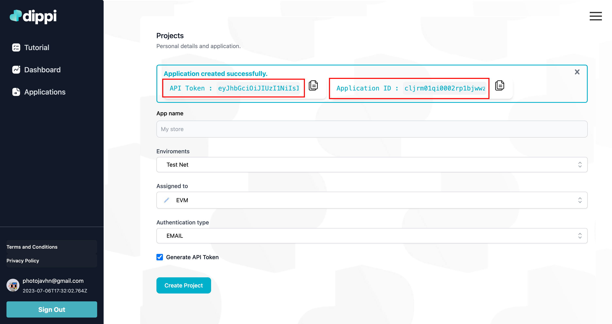

# Backend API Documentation

This document provides **technical** documentation for the backend API of your application and can go in-depth. In case of looking for a quickstart, look at our [SDK + React guide](sdk_react.md).

The backend is developed using Node.js and Express framework, and it comprises various routes that handle different functionalities such as user management, wallet operations, application handling, authentication, and more.

## **Introduction**

The backend API plays a pivotal role in the functionality and success of your application. It's designed to seamlessly handle various crucial tasks such as managing users, facilitating wallet operations, handling applications, enabling secure authentication, and more. To streamline these operations and provide enhanced features, your backend leverages the power of the **`@dippixyz/base`** library.

### **The Power of `@dippixyz/base`**

One of the core strengths of this backend lies in its integration with the **`@dippixyz/base`** library. This SDK offers a comprehensive set of tools and functionalities that empower your backend to interact seamlessly with the Dippi platform. By leveraging the capabilities of the **`@dippixyz/base`**, your backend gains access to a wealth of features that simplify application management, user authentication, wallet handling, and more.

The **`@dippixyz/base`** library serves as the bridge between your backend and the Dippi ecosystem. It encapsulates intricate processes, allowing you to focus on building an efficient and feature-rich backend without the need to handle intricate details manually. With the power of the SDK, your backend can execute actions smoothly and securely, offering a seamless experience to your users.

## Introduction

The backend API is responsible for handling various functionalities of your application. It is built using Node.js and Express, providing a set of routes that interact with different models to manage users, wallets, applications, authentication, and more.

## Routes

### TokenAccountFunc Router

The `tokenBoundAccount-router.js` manages wallet operations.

- `POST /dippi/tokenBoundAccount/create`: Create 6551.


## Models


### tokenBoundAccount Model

The `tokenBoundAccount.js` file provides methods to interact with tokenBoundAccount-related operations using the Dippi SDK.

### Method: create

```js
const TBA = require('@dippixyz/base');

const create = async (data) => {
    const TBAClient = new TBA(paramsOauthSession);
    TBAClient.init(tbaCreateOptions)
    return await TBAClient.create();
}

module.exports = {
    create,
};
```

### TBA: Quickstart guide


### Step 1: Getting your API token and Application ID

Go to our site: [client.dippi.xyz](http://client.dippi.xyz/). Once there you must create a project. That project will be loaded with all the necessary configurations to be used as rules when creating wallets for your users.

<!--  -->
<!-- Show img /static/img/site1.png -->
  <!--  -->
<!-- [](../../static/img/site1.jpg) -->


You’ll find the following form next:


Here’s what you need to know about each of the fields:

1. **App name**: Choose any name to identify the application you are registering.
2. **Environments**: Decide if the user wallets will be generated in test net or main net.
3. **Assigned to:**  Define the desired chain in which the w
4. **Authentication Type**: Define the type of authentication that will be shown to your users when they signup/sign in with Dippi. They’ll have two options:
    1. Email: the user will receive a confirmation email
    2. SMS : the user will receive a OTP via SMS to confirm their account.
5. **Generate API Token** : This will automatically generate an API Token for your app. You’ll use this API Token in the SDK as the requested credentials.

Example:



> ⚠️ IMPORTANT: Once your project is created you’ll obtain an API Token and Application ID: make sure to store these safely —back them up and don’t lose them!

Note: The `API Token`  can’t be recovered if lost. If you ever lose this, you’ll need to generate a new one. To create a new Token follow this guide: {{link}}

### Step 2: Installation and the button component

Once your `API Token` and `Application ID` are ready you can start using our SDK.

The example provided below assumes that you are using **`React + Typescript`** as a framework for your frontend. ***As mentioned earlier the methods provided by the SDK can also be used in your backend***.

1. Install the SDK. If you want to view the package in npm, click below: 
    
    [npm: @dippixyz/base](https://www.npmjs.com/package/@dippixyz/base)
    
    Open your project’s terminal and run this command: 
    
    ```sh
    npm i @dippixyz/base
    ```
    
    1. Once the SDK is installed you can import it this way:
    
    ```js
    const TBA = require('@dippixyz/base');
    ```
    
    1. We recommend creating an environment variable in your project (`.env`) or a separate file where you can store your credentials without exposing them in your code.
        
        *Assuming you have created a new .env file, you should get the following parameters:*
        
        ```js
        DIPPI_API_TOKEN = <*YOUR_API_TOKEN*>
        DIPPI_APPLICATION_ID = <*YOUR_APPLICATION_ID*>
        DIPPI_URL = https://api.dippi.xyz 
        ```
     ***The `DIPPI_URL` parameter should always be the one in the example above.***

2. The following is your index file. Add the call to the TBA SDK function in order to consume the services: 
    ```js
    const app = express();
    const TBA = require('@dippixyz/base');


    app.get('/test', async (req, res) => {
        //Authentication parameters, previously obtained in step 1, on the DIPPI platform.
        const TBAClient = new TBA({
            appToken: APP_TOKEN,
            appId: APP_ID,
            url: CLIENT_URL,
        });

        //If you do not specify the parameters destinationWallet and NFTid, DIPPI will generate the values.
        const tbaCreateOptions = {
            nftContract: <destinationWallet>,
            destinationWallet:<NFTdropContract>,
            nftId: <NFTid>
        } 

        TBAClient.init(tbaCreateOptions)

        try {
            let tbaObj = await TBAClient.create()
            res.send({'tbaObj': tbaObj})
        } catch (error) {
            res.send({'error validation': error})
        }
    }
    ```
    A test method is defined with the route "test". Keep in mind that its nature will be asynchronous. In this case, the response will be resolved using an await, and you can also apply a then to the promise.
    