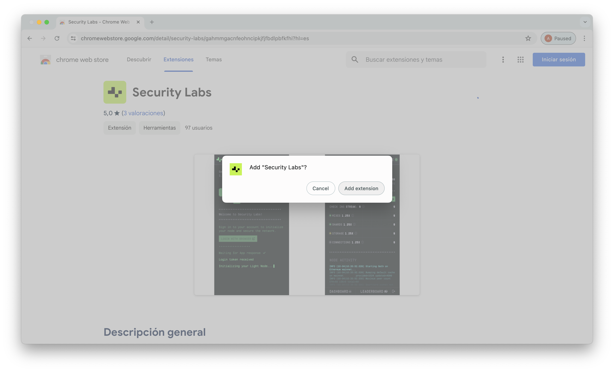
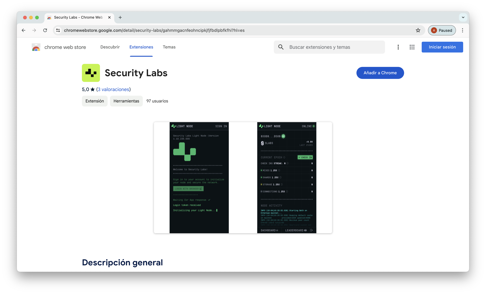
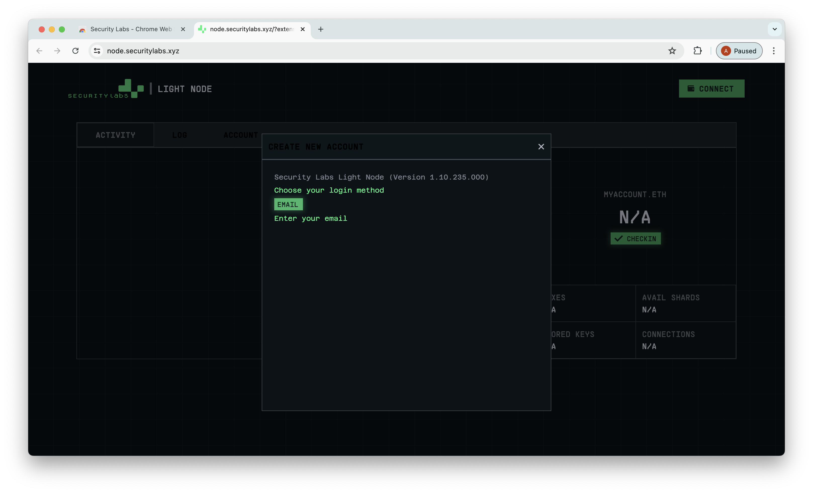
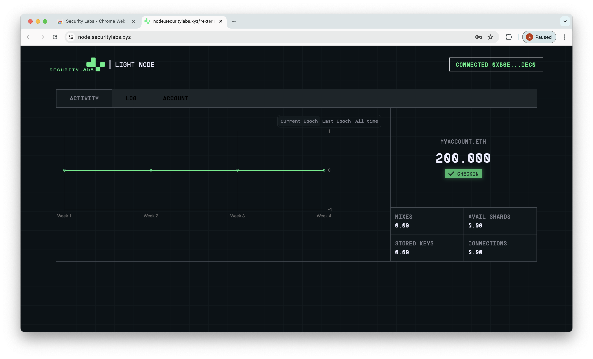
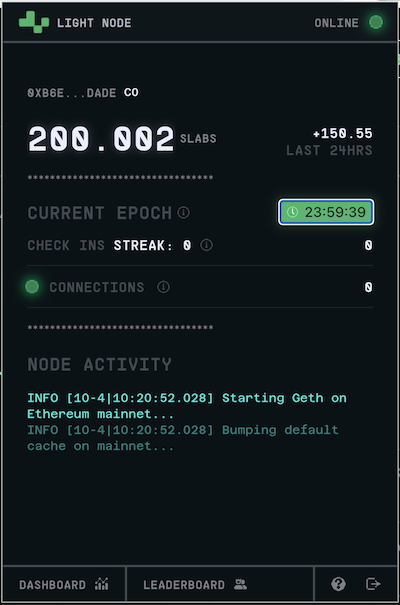

# Become a Light Node

This simple guide shows a step by step on how to become a node in Functor Network

1. Click **[here](https://chromewebstore.google.com/detail/security-labs/gahmmgacnfeohncipkjfjfbdlpbfkfhi)** to open the Chrome Web Store in Google Chrome and add our extension to your browser.

    
    

2. Once the extension is added it will take you to our node's website. If not, open it **[here](https://node.securitylabs.xyz)**.

    

3. Click the connect button to create a new account or connect an existing wallet to our app, use the invitation code you were given when you were invited and follow the steps on screen.

    

    Once you create the account or connect your wallet you should be logged in and a screen like the following should appear.

    

4. Open the extension and hit the CHECK IN button to maximize your rewards. Do this on a daily basis to keep earning.

    

5. Any questions? Send an email to help@securitylabs.xyz