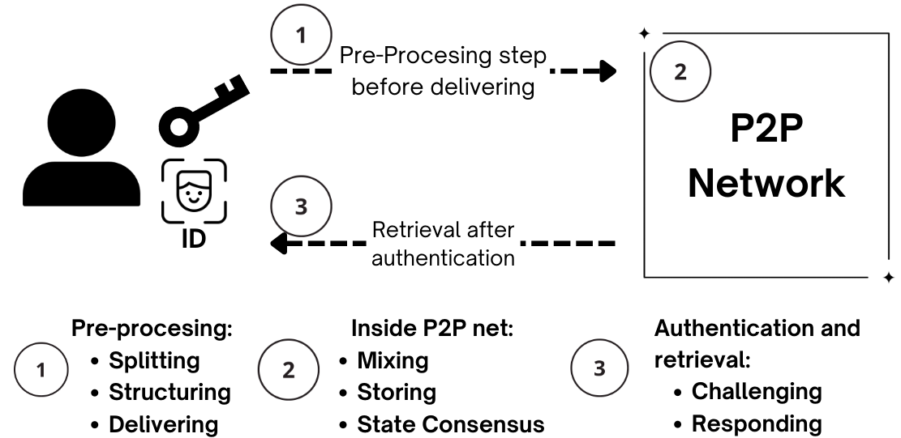

<!-- 
TODOs:
- Add Description for State-shared and authentication groups, as well as deeper discussion over network architecture.
-->

# State Observing Network

From the user's perspective, our state-observing network can be simplified to just an interface to store and retrieve private keys (or, more generally, [cryptographic tokens](../overview#cryptographic-token)). This happens in three steps: 

1. Pre-processing
2. Network processing
3. Authentication and retrieval

The initial conditions for this process are the **user's key they desire to protect**, and **a [SCAS-compatible](../overview#state-change-authentication-scheme) authentication process**. 

A bit more detailed walkthrough for each step breaks down each as follows:

## 1. Pre-processing
The following are done securely on client-side:

a. **Splitting:** The key shards and identity-authentication information is securely split by using Shamir-secrets-sharing (SSS), chosen for its perfect (information-theoretic) security guarantees. 

b. **Structuring:** Refers to the process of building the [SCAT](../overview#state-change-authentication-token), which basically involves protecting both, key shard and ID shard, as well as a homomorphically encrypted authentication instructions for the [auth & challenge process](#3-authentication-and-retrieval) by using encryption only breakable with a brute-force approach expected from the client during retrieval. This is not computationally intractable neither does it affect UX. It only serves the purpose of making it intractable for an attacker to try many key shard combinations at scale.

c. **Delivering:** Each SCAT is sent into the State Observing Network with [onion layering](https://en.wikipedia.org/wiki/Onion_routing) being done. That is, the network is queried for its current chosen ephemeral sub [mix net](https://en.wikipedia.org/wiki/Mix_network?wprov=srpw1_0) (which changes randomly and unpredictably to prevent enough time for well-designed collusion attacks) and the client-side prepared an onion message to be sent into the network for mixing.

## 2. Network Processing
a. **Mixing:** SCATs' traffic is mixed such that no correlation of their origin can be traced back, specially after being appended to other messages in form of a final batch to be delivered to the indented storage node (randomly selected by client-side).

b. **Storing:** The storage is being done efficiently to optimize for retrieval requests checking performance by using [Bloom filters](https://en.wikipedia.org/wiki/Bloom_filters) and intelligent [sampling](https://en.wikipedia.org/wiki/Sampling_(statistics)), as well as disk space, to reduce costs while preserving security.

c. **State Consensus:** The underlying peer-to-peer network manages global variables such as nodes reliability, current staking quantities, past success rates and other behavioral metrics to prioritize network services quality. Said state must be distributed by using a staking mechanism, which as additionally used to prioritize (partially, to preserve significant levels of true randomness) being selected for network services participation.

## 3. Authentication and retrieval
a. **Challenging:** A retrieval request contains information which matches a subset of storage nodes which not all correspond to the sought SCATs', to introduce ambiguity. This match is done via public, but secure, global data on the P2P net. Each matched node calls their state-shared group to initiate a challenge process.

A *challenge* is a call to the retrieval requester to provide some significant score in a statistical test against the state information each shared-state group has. This is done using MPC. Only one randomly-selected (based on a staking-mechanism) member of the group makes up the challenge.

b. **Responding:** Each state-shared group will notify the storage node of the challenge result and - if positive - the storage node will send its shard to the requester. Since responses are independent, the shards will arrive to the user in at random times and in random order; with no obvious information on how to reconstruct the key. This is intended for security reasons.

The user will have to reconstruct the key from the shards in a local brute-force procedure, from which is computationally intractable to extract information from even if only one shard is missing.

!!! tip "Next Steps: [Threat model](../threat_model#introduction)"
    Each part of the process can be analyzed for security using threat modelling, a conceptual and measurable framework to describe the risk our system is exposed to, behind which specific conditions and assumptions. See [Threat model](../threat_model#introduction) for more.
